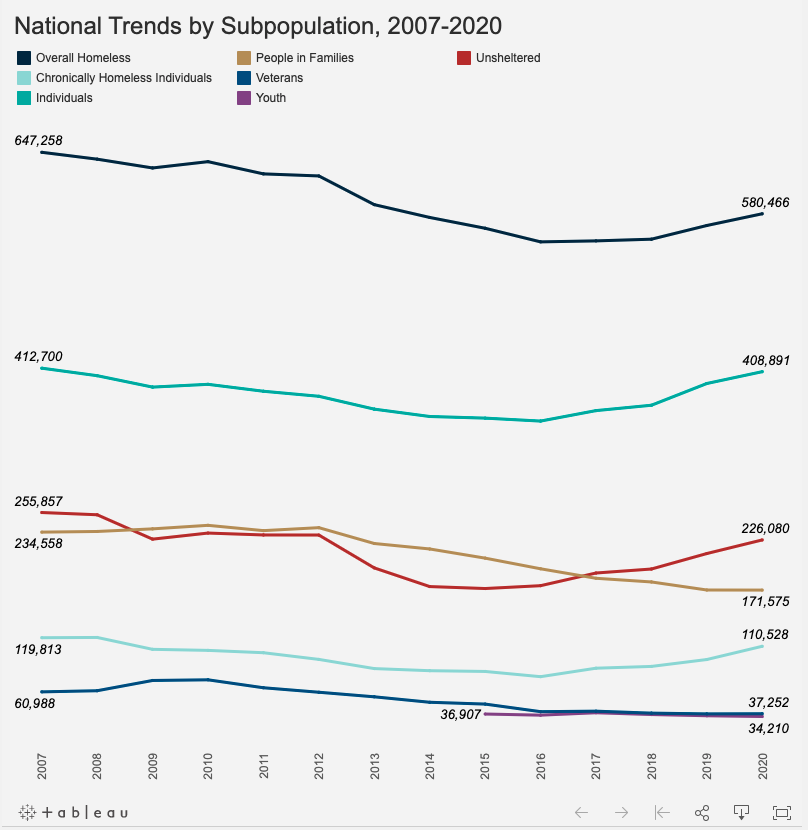

```{r setup, include=FALSE}
knitr::opts_chunk$set(echo = TRUE)
library(tidyverse)
library(readxl)
library(scales)
library(ggrepel)
```

## Overview

Original visualization:

Link to visualization: https://endhomelessness.org/homelessness-in-america/homelessness-statistics/state-of-homelessness-2021/

```{r original-plot, echo=FALSE}


```

Claim:

While progress with homelessness since 2007 have been modest, there have been significant variation among subgroups, with veterans making a striking improvement.

## Design

Overall, the visualization chosen was a line plot with Years on the x-axis and Count on the y-axis. The line plot is segmented by category types with 7 types of homeless people chosen - Overall Homeless, Chronically Homeless, Individuals, Familes, Youth, Veterans, and Unsheltered. The 7 types were given a line each with a different color mapped to each line. There was also labels for the first and last year, but no y-axis was shown. I think the author chose this type of plot because it would be easy to track changes over time, and looking at the height of the lines make it easy to tell how a homeless segment compares with another segment.

I think that it was inappropriate that the y-axis was not displayed because I think its essential to be able to know how much the count of homeless people changed over the years. It is really difficult to estimate the counts near the center, or to understand how different in counts there are betweent he lines. 
Overall, I think that the visual is effective because of its cleanliness and simplicity. The categories are easy to interpret, and the colors on the lines make it wasy to track differences. Since it was originally interactive in the website, I think that it is a fairly effective plot.

## Data

### Data Overview
Load in each dataset from 2007 to 2020.
```{r message = FALSE}
#Load in CSV files from PIT-Estimates-by-CoC database by year
data_2020<- read_csv("~/portfolio-dkwik/datavis/data_2020.csv")
data_2019<- read_csv("~/portfolio-dkwik/datavis/data_2019.csv")
data_2018<- read_csv("~/portfolio-dkwik/datavis/data_2018.csv")
data_2017<- read_csv("~/portfolio-dkwik/datavis/data_2017.csv")
data_2016<- read_csv("~/portfolio-dkwik/datavis/data_2016.csv")
data_2015<- read_csv("~/portfolio-dkwik/datavis/data_2015.csv")
data_2014<- read_csv("~/portfolio-dkwik/datavis/data_2014.csv")
data_2013<- read_csv("~/portfolio-dkwik/datavis/data_2013.csv")
data_2012<- read_csv("~/portfolio-dkwik/datavis/data_2012.csv")
data_2011<- read_csv("~/portfolio-dkwik/datavis/data_2011.csv")
data_2010<- read_csv("~/portfolio-dkwik/datavis/data_2010.csv")
data_2009<- read_csv("~/portfolio-dkwik/datavis/data_2009.csv")
data_2008<- read_csv("~/portfolio-dkwik/datavis/data_2008.csv")
data_2007<- read_csv("~/portfolio-dkwik/datavis/data_2007.csv")

#Veterans data missing in PIT-Estimates-by-CoC from 2007-2010, so use PIT-Estimates-by-state dataset instead durng wrangling step.
data_2010_replaced<- read_csv("~/portfolio-dkwik/datavis/data_2010_replaced.csv")
data_2009_replaced<- read_csv("~/portfolio-dkwik/datavis/data_2009_replaced.csv")
data_2008_replaced<- read_csv("~/portfolio-dkwik/datavis/data_2008_replaced.csv")
data_2007_replaced<- read_csv("~/portfolio-dkwik/datavis/data_2007_replaced.csv")

#show example of dataframe
data_2020
```

I was able to find the original data because it was included at the end of the article. The visualization was created by the National Alliance to End Homelessness, and the data itself was collected and provided by the US Department of Housing and Urban Development.

I got the data using the "2007-2020 Point-in-Time Estimates by CoC" dataset found here: <https://www.hudexchange.info/resource/3031/pit-and-hic-data-since-2007/>

The organization who collected the data is the US Department of Housing and Urban Development (HUD) and they have provided this data freely to the public for use. They provide updates to this dataset every year, and this latest data was uploaded on March 2021. It was created by HUD and was also approved by HUD. There was no information provided about specific contributors.

This dataset aggregated biannual point-in-time counts of people experiencing homelessness conducted by Continuums of Care (CoCs), regional planning bodies that coordinate housing and resources for homeless individuals and family.

### Data Details

Since I have many datasets to combine in wrangling, I'll use the 2020 dataset to describe the data. Each row represents a CoC and their Point-in-Time counts, segmented by different demographics, such as race, age, and sheltered/unshelteredness.

In the 2020 dataset, there are `r nrow(data_2020)` rows.

It would be interesting to know where they get the data used to make these segmentations on demographics, as well as what they mean by Sheltered ES, TH, SH in the columns. It will be also important to know if each column is mutually exclusive, or if there are overlaps between columns.


### Wrangling


I will need to create a table combining data from 2007 to 2020 into one table with the following columns:
year, total overall homeless, total chronically homeless individuals, individuals, people in families, veterans, youth, unsheltered. I will do this by doing the following: 

(1) For each yearly dataset,
  -Selecting the right columns that match the homeless categories
  -Filtering in the row that has total count data for the columns (usually the last row)
  -Replace column names to a standard list of column names across each yearly dataset
  -Mutate and add a column that describes the year of that dataset
(2) Concatenate all yearly datasets from 2007-2020 into one dataframe
(3) Pivot the combined dataset longer to structure the data for a line plot.

```{r}
## Create an array of new column names to rename dataframes. Column names need to match in order to concatenate the dataframes in the final step of wrangling.

colnames <- c('Overall Homeless', 'Chronically Homeless Individuals', 'Individuals', 'People in Families', 'Veterans', 'Youth', 'Unsheltered')
## Create the table for the year 2020, selecting the 7 relevant columns

sel_2020 <- data_2020 %>% 
  filter(`CoC Name` == 'Total' ) %>% 
  select("Overall Homeless, 2020", 
         "Overall Chronically Homeless Individuals, 2020", 
         "Overall Homeless Individuals, 2020", 
         "Overall Homeless People in Families, 2020", 
         "Overall Homeless Veterans, 2020", 
         "Overall Homeless Unaccompanied Youth (Under 25), 2020", 
         "Unsheltered Homeless, 2020" ) %>% 
  set_names(colnames) %>% 
  mutate(Year = "2020")

##Repeat for 2007-2019
sel_2019 <- data_2019 %>% 
  filter(`CoC Name` == 'Total' ) %>% 
  select("Overall Homeless, 2019", 
         "Overall Chronically Homeless Individuals, 2019", 
         "Overall Homeless Individuals, 2019", 
         "Overall Homeless People in Families, 2019",
         "Overall Homeless Veterans, 2019",
         "Overall Homeless Unaccompanied Youth (Under 25), 2019", 
         "Unsheltered Homeless, 2019" ) %>% 
  set_names(colnames) %>% 
  mutate(Year = "2019")

sel_2018 <- data_2018 %>% 
  filter(`CoC Name` == 'Total' ) %>% 
  select("Overall Homeless, 2018", 
         "Overall Chronically Homeless Individuals, 2018",
         "Overall Homeless Individuals, 2018",
         "Overall Homeless People in Families, 2018",
         "Overall Homeless Veterans, 2018", 
         "Overall Homeless Unaccompanied Youth (Under 25), 2018", 
         "Unsheltered Homeless, 2018" ) %>% 
  set_names(colnames) %>% 
  mutate(Year = "2018")

sel_2017 <- data_2017 %>% 
  filter(`CoC Name` == 'Total' ) %>% 
  select("Overall Homeless, 2017", 
         "Overall Chronically Homeless Individuals, 2017",
         "Overall Homeless Individuals, 2017",
         "Overall Homeless People in Families, 2017",
         "Overall Homeless Veterans, 2017",
         "Overall Homeless Unaccompanied Youth (Under 25), 2017",
         "Unsheltered Homeless, 2017" ) %>% 
  set_names(colnames) %>% 
  mutate(Year = "2017")

sel_2016 <- data_2016 %>% 
  filter(`CoC Name` == 'Total' ) %>% 
  select("Overall Homeless, 2016",
         "Overall Chronically Homeless Individuals, 2016", 
         "Overall Homeless Individuals, 2016", 
         "Overall Homeless People in Families, 2016",
         "Overall Homeless Veterans, 2016",
         "Overall Homeless Unaccompanied Youth (Under 25), 2016",
         "Unsheltered Homeless, 2016" ) %>% 
  set_names(colnames) %>% 
  mutate(Year = "2016")

sel_2015 <- data_2015 %>% 
  filter(`CoC Name` == 'Total' ) %>% 
  select("Overall Homeless, 2015",
         "Overall Chronically Homeless Individuals, 2015",
         "Overall Homeless Individuals, 2015", 
         "Overall Homeless People in Families, 2015", 
         "Overall Homeless Veterans, 2015", 
         "Overall Homeless Unaccompanied Youth (Under 25), 2015",
         "Unsheltered Homeless, 2015" ) %>% 
  set_names(colnames) %>% 
  mutate(Year = "2015")

  ## Since Youth data doesn't exist in years 2014 and below, do not select "Overall Homeless Unaccompanied Youth (Under 25), XXXX" column and add an empty column in its place to preserve dataframe structure.
sel_2014 <- data_2014 %>%
  filter(`CoC Name` == 'Total') %>%
  select(
    "Overall Homeless, 2014",
    "Overall Chronically Homeless Individuals, 2014",
    "Overall Homeless Individuals, 2014",
    "Overall Homeless People in Families, 2014",
    "Overall Homeless Veterans, 2014",
    "Unsheltered Homeless, 2014"
  ) %>%
  add_column(Youth = NA, .after = "Overall Homeless Veterans, 2014") %>%
  set_names(colnames) %>%
  mutate(Year = "2014")

sel_2013 <- data_2013 %>%
  filter(`CoC Name` == 'Total') %>%
  select(
    "Overall Homeless, 2013",
    "Overall Chronically Homeless Individuals, 2013",
    "Overall Homeless Individuals, 2013",
    "Overall Homeless People in Families, 2013",
    "Overall Homeless Veterans, 2013",
    "Unsheltered Homeless, 2013"
  ) %>%
  add_column(Youth = NA, .after = "Overall Homeless Veterans, 2013") %>%
  set_names(colnames) %>%
  mutate(Year = "2013")

sel_2012 <- data_2012 %>%
  filter(`CoC Name` == 'Total') %>%
  select(
    "Overall Homeless, 2012",
    "Overall Chronically Homeless Individuals, 2012",
    "Overall Homeless Individuals, 2012",
    "Overall Homeless People in Families, 2012",
    "Overall Homeless Veterans, 2012",
    "Unsheltered Homeless, 2012"
  ) %>%
  add_column(Youth = NA, .after = "Overall Homeless Veterans, 2012") %>%
  set_names(colnames) %>%
  mutate(Year = "2012")

sel_2011 <- data_2011 %>%
  filter(`CoC Name` == 'Total') %>%
  select(
    "Overall Homeless, 2011",
    "Overall Chronically Homeless Individuals, 2011",
    "Overall Homeless Individuals, 2011",
    "Overall Homeless People in Families, 2011",
    "Overall Homeless Veterans, 2011",
    "Unsheltered Homeless, 2011"
  ) %>%
  add_column(Youth = NA, .after = "Overall Homeless Veterans, 2011") %>%
  set_names(colnames) %>%
  mutate(Year = "2011")

## Column `Overall Homeless Veterans, 2010` doesn't exist in PIT-Estimates-by-CoC database. Use PIT-Estimates-by-state database instead for 2007-2010
sel_2010 <- data_2010_replaced %>%
  filter(`State` == 'Total') %>%
  select(
    "Overall Homeless, 2010",
    "Overall Chronically Homeless Individuals, 2010",
    "Overall Homeless Individuals, 2010",
    "Overall Homeless People in Families, 2010",
    "Overall Homeless Veterans, 2010",
    "Unsheltered Homeless, 2010"
  ) %>%
  add_column(Youth = NA, .after = "Overall Homeless Veterans, 2010") %>%
  set_names(colnames) %>%
  mutate(Year = "2010")

sel_2009 <- data_2009_replaced %>%
  filter(`State` == 'Total') %>%
  select(
    "Overall Homeless, 2009",
    "Overall Chronically Homeless Individuals, 2009",
    "Overall Homeless Individuals, 2009",
    "Overall Homeless People in Families, 2009",
    "Overall Homeless Veterans, 2009",
    "Unsheltered Homeless, 2009"
  ) %>%
  add_column(Youth = NA, .after = "Overall Homeless Veterans, 2009") %>%
  set_names(colnames) %>%
  mutate(Year = "2009")

sel_2008 <- data_2008_replaced %>%
  filter(`State` == 'Total') %>%
  select(
    "Overall Homeless, 2008",
    "Overall Chronically Homeless Individuals, 2008",
    "Overall Homeless Individuals, 2008",
    "Overall Homeless People in Families, 2008",
    "Overall Homeless Veterans, 2008",
    "Unsheltered Homeless, 2008"
  ) %>%
  add_column(Youth = NA, .after = "Overall Homeless Veterans, 2008") %>%
  set_names(colnames) %>%
  mutate(Year = "2008")

sel_2007 <- data_2007_replaced %>%
  filter(`State` == 'Total') %>%
  select(
    "Overall Homeless, 2007",
    "Overall Chronically Homeless Individuals, 2007",
    "Overall Homeless Individuals, 2007",
    "Overall Homeless People in Families, 2007",
    "Overall Homeless Veterans, 2007",
    "Unsheltered Homeless, 2007"
  ) %>%
  add_column(Youth = NA, .after = "Overall Homeless Veterans, 2007") %>%
  set_names(colnames) %>%
  mutate(Year = "2007")

## show output of sel_2020
knitr::kable(sel_2020)

```
```{r}

##Concatenate datasets sel_2007 - sel_2020
combined <-
  rbind(
    sel_2020,
    sel_2019,
    sel_2018,
    sel_2017,
    sel_2016,
    sel_2015,
    sel_2014,
    sel_2013,
    sel_2012,
    sel_2011,
    sel_2010,
    sel_2009,
    sel_2008,
    sel_2007
  )

#show combined dataframe
knitr::kable(combined)

```

```{r}

## Pivot longer to create structure for line plot
combined_longer <-
  combined %>% pivot_longer(cols = 1:7,
                            names_to = "Category",
                            values_to = "Count")
#show pivoted dataframe
knitr::kable(combined_longer)
```


## Replication

To replicate the visualization I will do the following:

(1) Plot line graph, mapping color to Category, x-axis to Year, and y-axis to Count
(2) Adjust axis increments
(3) Remove background and y-axis
(4) Add labels to first and last years

```{r message=FALSE}


##Create dataframes for First and Last value labels to add to plot
data_last <- combined_longer %>% filter(Year == 2020)
data_first <- combined_longer %>% filter(Year == 2007)
data_first_2015 <- combined_longer %>% filter(Year == 2015, Category == "Youth")

## Plot graph
ggplot(combined_longer, aes(x=as.numeric(Year), y = Count, color = Category)) +
  geom_line() +
  scale_x_continuous(n.breaks=14 ) +
#remove background and y-axis
  theme(axis.text.y=element_blank(),
        axis.ticks=element_blank(),
        axis.title.y=element_blank(),
        axis.title.x=element_blank(),
        panel.background=element_blank(),
        panel.border=element_blank(),
        panel.grid.major=element_blank(),
        panel.grid.minor=element_blank(),
        plot.background=element_blank(), 
        legend.position="top", legend.title=element_blank()) +
  labs(title = "National Trends by Subpopulation, 2007-2020") +
#add labels to first and last years
  geom_text_repel(aes(label = Count), data = data_last,
    fontface ="plain", color = "black", size = 3) +
  geom_text_repel(aes(label = Count), data = data_first,
    fontface ="plain", color = "black", size = 3) +
  geom_text_repel(aes(label = Count), data = data_first_2015,
    fontface ="plain", color = "black", size = 3)


```


I encountered some difficulties with wrangling the data. Firstly, the dataset didn't always have matching columns names across the years, and so I needed to find the appropriate column name and rename them. Secondly, the dataset that I used didn't have some columns entirely that was necessary to create the plot, and so I had to use a different dataset halfway ("PIT-Estimates-by-State). This was something that was difficult to anticipate beforehand.

Other things that were challenging was that the raw dataset had 542 columns, with many of them sounding similar. A large part of the time it took was to understand how the 542 columns related to one another (some were standalone, others were sums of a combination of other columns, etc.), and to find which 7 were the ones to use for my visualization.

Another difficulty was that not every category had data from 2007-2020. The youth category, for example, only had data from 2015-2020. I needed to resolve this conflict during the combination step because the columns for 2015-2020 were different from 2007-2014, and I could not simply concatenate them. 


## Alternatives

### Design

<!-- Describe at least two alternative design choices that could be made in visualizing your data. For each design, include: -->
One alternative design choice could be to include grids and the y-axis in the visualization. Originally, the visual removed gridlines and the y-axis, and only included the y-values for the first and last columns.This made it hard to tell what the values for the middle years were because there was no point of reference. It did make the plot look cleaner, but at the expense of interpretation. An alternative choice would be to include the gridlines and include the y-axis. This will make the horizontal tracking of the eye easier so that we can more easily reference values in the middle of the plot.

<!--     What choice did the original visual make? (e.g., to use a particular aesthetic mapping or glyph) -->
 Another alternative design choice could be to include points to demarcate the years. Originally, the plot only only included the line plots without marking the separation between points, and that made it hard to vertically track where the years lined up with the points. It also gave the illusion that the homeless count estimates were continuous or that we had monthly numbers when in fact it was a yearly count. I recommend adding points onto the plot so that the viewer can trace the data point to the x-axis year more easily. Adding a grid in the previous improvement will similarly help with this. It will also make it explicit that it is a yearly count.


### Implementation

```{r message=FALSE}

##Create dataframes for First and Last value labels to add to plot
data_last <- combined_longer %>% filter(Year == 2020)
data_first <- combined_longer %>% filter(Year == 2007)
data_first_2015 <- combined_longer %>% filter(Year == 2015, Category == "Youth")

## Plot graph
ggplot(combined_longer, aes(x=as.numeric(Year), y = Count, color = Category)) +
  geom_line() +
  geom_point() +
  scale_y_continuous(n.breaks = 6, labels = label_number(suffix = " K", scale = 1e-3)) +
  scale_x_continuous(n.breaks=14 ) +
#remove background and y-axis
  theme(plot.background=element_blank(), 
        legend.position="top") +
  labs(title = "National Homelessness Trends by Subpopulation, 2007-2020", x = "Year",  y = "Point-in-Time Estimate (Count)" ) +
#add labels to first and last years
  geom_text_repel(aes(label = Count), data = data_last,
    fontface ="plain", color = "black", size = 2.5, alpha = 0.4) +
  geom_text_repel(aes(label = Count), data = data_first,
    fontface ="plain", color = "black", size = 2.5, alpha = 0.4) +
  geom_text_repel(aes(label = Count), data = data_first_2015,
    fontface ="plain", color = "black", size = 2.5, alpha = 0.4)

```


## Summary

<!-- Now that you’ve gone through the whole process, how has your understanding of, and belief in, the original article’s claim changed? -->
After going through the process, my faith in the original article's claim has increased. This is because I have inspected the data myself and found that the plot came out to look the same. The only point of question is why the article chose those 7 categories instead of the many other categories that the data made available. For example, 'Youth' was assumed to be of age <25, but the data also included a youth under <18 category, which I thought was more appropriate to use. I also wondered why the original visualization didn't include segmentation by race or location. I thought those would have been useful and insightful visualizations.

Overall, my replication was faithful, and I managed to get it almost exactly the same, aside from color of the lines. I thought that my alternative design also improved the visualization and overall made better design choices. Perhaps the reason the original design was skeletal was because it was Tableau based and had some interactive elements.

To follow up, I would do deeper exploratory plots with the different segments to find more patterns and trends about homelessness. This plot only covered 7 out of the 542 different ways to segment the homeless population, so I am certain there are other insights that we can draw from the dataset. I see opportunities to do some predictive modeling to understand how the trends in homelessness is expected to change in the coming years. 

Overall I enjoyed the whole experience, and saw how wrangling of the data can be the most time consuming part of the data visualization. Generating the plot itself only took me about 15 minutes or so, but the wrangling the datasets (especially since they came in separate csv files) took the majority of my time in this project. I also found myself having to search Google to find out how to do certain things in R many, many times during this project, and eventually I would love to be able to do all that quickly from memory. A great experience overall!

